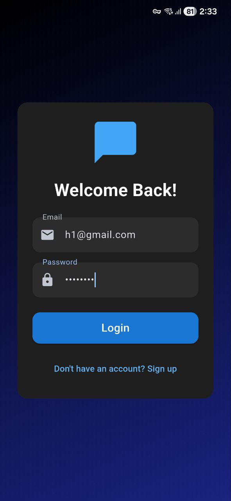
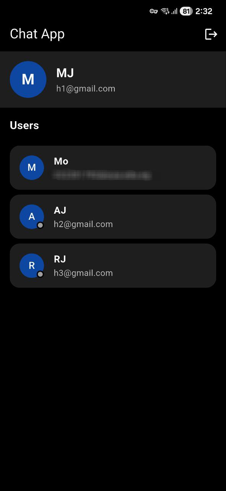
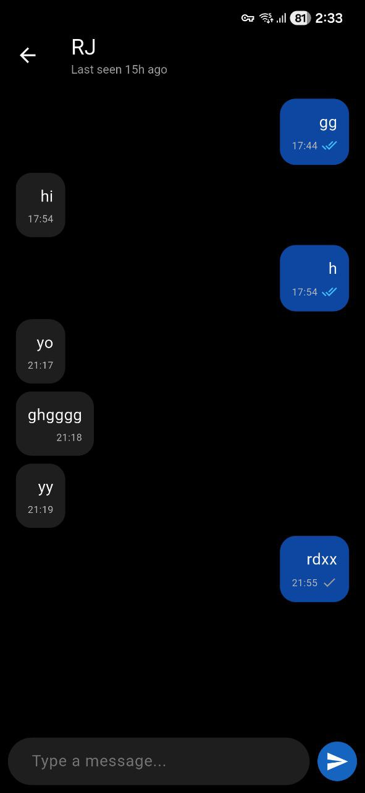

# Flutter Chat Application

A real-time mobile chat application built with Flutter and Firebase as a final project for the Mobile Computing course. This app demonstrates the integration of Firebase Authentication, Cloud Firestore, and the Realtime Database to create a seamless messaging experience with a modern dark interface.

## 📱 Features

* **Authentication**: Secure Email/Password Sign Up and Login.
* **Real-time Messaging**: Instant message delivery using Cloud Firestore.
* **Global Online Status**: Real-time "Online" and "Last Seen" indicators.
* **Typing Indicators**: Live "Typing..." status shown to the receiver.
* **Read Receipts**: Blue ticks indicate when a message has been read.
* **AMOLED Dark Theme**: Battery-efficient and aesthetic dark UI.

## 🛠️ Tech Stack

* **Frontend**: Flutter (Dart)
* **Backend**: Firebase
  * **Authentication**: User management and session handling.
  * **Cloud Firestore**: Persistent storage for user profiles and chat history.
  * **Realtime Database**: Ephemeral state management (Presence/Typing).

## 🚀 Getting Started

### Prerequisites

* Flutter SDK installed.
* Android Studio or VS Code configured.
* A Firebase Project set up.

### Installation

1. **Clone the repository**

```bash
git clone https://github.com/yourusername/your-repo-name.git
cd your-repo-name
```

2. **Install Dependencies**

```bash
flutter pub get
```

3. **Firebase Setup**
   * Create a project in the [Firebase Console](https://console.firebase.google.com/).
   * Add your Android app (package name: `com.example.chat_app`).
   * Download `google-services.json` and place it in `android/app/`.
   * Enable Authentication (Email/Password provider).
   * Enable Firestore Database and Realtime Database in test mode.

4. **Run the App**

```bash
flutter run
```

## 📸 Screenshots

| Login Screen | Home Screen | Chat Screen |
|--------------|-------------|-------------|
|  |  |  |

## Tested on Android 16 & 13

## 📥 Download App

<a href="INSERT_YOUR_RELEASE_LINK_HERE">
  
</a>

[Click here to download the latest APK (v1.0.0)](https://github.com/mohamedojaheen/ChatApp/releases/tag/v1.0.0)
